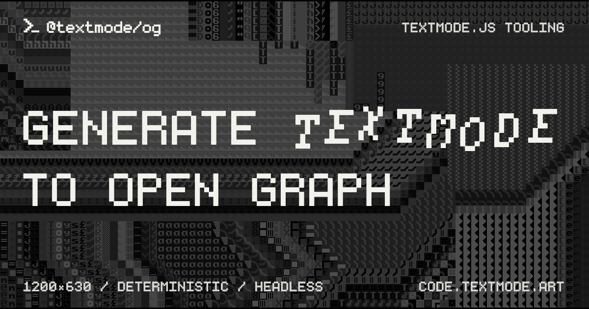

# @textmode/og

<div align="center">



| [](https://www.typescriptlang.org/) [](https://nodejs.org/) [](https://playwright.dev/) | [](https://code.textmode.art/) [](https://discord.gg/sjrw8QXNks) | [](https://ko-fi.com/V7V8JG2FY) [](https://github.com/sponsors/humanbydefinition) |
| :---------------------------------------------------------------------------------------------------------------------------------------------------------------------------------------------------------------------------------------------------------------------------------------------------------------------------------------------------------------------- | :------------------------------------------------------------------------------------------------------------------------------------------------------------------------------------------------------------------------------------------------------------------------------- | :-------------------------------------------------------------------------------------------------------------------------------------------------------------------------------------------------------------------------------------------------------- |

</div>

`@textmode/og` is an Open Graph image generator for the [textmode.js](https://github.com/humanbydefinition/textmode.js) ecosystem. It renders deterministic 1200×630 images from [editor.textmode.art](https://editor.textmode.art/) sketches through a CLI or a Node interface.

Input sketches use the editor runtime directly: `t`, silent `audio`, synth helpers, and the editor add-ons are injected, so a sketch must not call `textmode.create()`. The package provides the gallery and main editor layouts, deterministic frame capture, local sketch assets, PNG validation, and atomic output writes.

## Features

- **CLI and Node interface** - Gallery and main editor layouts through one command or `generateOgImages()`
- **Deterministic frame capture** - Render any frame from 1 to 1000 for stable, repeatable output
- **Local sketch assets** - Relative images, fonts, video, and data resolve against the sketch directory
- **Atomic output writes** - Each PNG is validated and renamed into place; a failed job preserves an existing destination image
- **Branding overrides** - Swap the logo and label text without touching the fixed layout geometry
- **Secure execution** - Sketches run in isolated browser contexts without Node access

## Installation

```bash
npm install --save-dev @textmode/og
npx textmode-og install-browser
```

Requires Node.js 24 or newer. Chromium is installed only when requested.
Package installation does not download a browser.

## CLI

Create a gallery image from a local editor-style sketch:

```bash
npx textmode-og gallery ./sketch.js \
  --title "Signal Bloom" \
  --description "A deterministic textmode sketch." \
  --author "Example Artist" \
  --output ./og.png
```

Create the main layout:

```bash
npx textmode-og main ./sketch.js --frame 120 --darken 70
```

An `https://editor.textmode.art/#share=...` URL can be used instead of a file.
Quote share URLs in the shell. They are decoded locally; the CLI never fetches
the editor site.

Local files resolve relative images, fonts, video, and data against the
sketch’s directory. Share URLs have no local asset root. Remote assets remain
subject to normal browser and CORS rules.

Run `npx textmode-og --help` for all options.

## Node interface

```ts
import { generateOgImages } from '@textmode/og';

const results = await generateOgImages({
	jobs: [
		{
			id: 'signal-bloom',
			source: { kind: 'file', path: './sketch.js' },
			outputPath: './og.png',
			frame: 60,
			layout: {
				kind: 'gallery',
				title: 'Signal Bloom',
				description: 'A deterministic textmode sketch.',
				authorName: 'Example Artist',
			},
		},
	],
});
```

Jobs run sequentially in one browser session and isolated browser contexts.
Each output is captured into a temporary file, validated, and atomically
renamed. A failed job preserves an existing destination image.

Sources can be local files, inline code, or editor share URLs:

```ts
type OgSketchSource =
	| { kind: 'file'; path: string }
	| { kind: 'code'; code: string; assetRoot?: string }
	| { kind: 'editor-share-url'; url: string };
```

Gallery jobs default to frame `60` and darken `55`; main jobs default to frame
`60` and darken `70`. Frames range from `1` through `1000`, and darken values
from `0` through `100`.

## Branding

Fonts, colors, dimensions, and layout geometry are fixed. A logo and label text
can be overridden:

```json
{
	"logoPath": "./logo.svg",
	"labels": {
		"brandName": "example.art",
		"galleryBadge": "FEATURED SKETCH",
		"galleryAuthorPrefix": "made by",
		"mainTopRight": "FREE + OPEN SOURCE",
		"mainHeadlinePrefix": "CREATE",
		"mainHeadlineEmphasis": "TEXTMODE",
		"mainHeadlineSecondLine": "IN YOUR BROWSER",
		"mainBottomLeft": "LIVE CODE / CHARACTER GRAPHICS",
		"mainBottomRight": "BROWSER-BASED / TEXTMODE.JS"
	}
}
```

Pass the JSON to the CLI with `--branding`. Its `logoPath` is resolved relative
to the JSON file. Imported `logoPath` values are resolved from
`process.cwd()`. Logos must be SVG files with a `viewBox`.

## Security

Sketches execute as browser JavaScript without Node access. The local asset
server is read-only and prevents access outside the configured asset root.
Sketches may still make network requests, so generate images only from code
you trust to access the network.

## License

`@textmode/og` is licensed under the [AGPL-3.0 License](./LICENSE).
